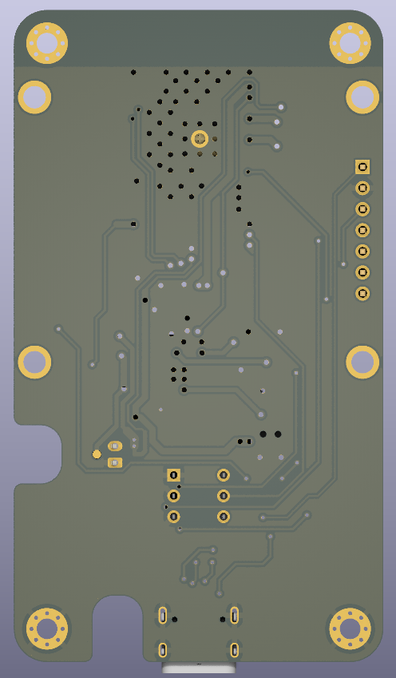

# Smart Button with ESP32

## Overview
This project is a **Smart Button** based on the ESP32 microcontroller. It is designed to function as a wireless communication interface for triggering predefined actions. The button integrates **ESP-NOW**, **Wi-Fi**, **battery monitoring**, and an **OLED display** for visual feedback. The project includes both **firmware** (ESP32-side) and a **software application** (computer-side) for further integration and automation.

## Features
- **ESP-NOW Wireless Communication:** Enables low-latency, direct device-to-device communication.
- **OLED Display (SSD1351, SPI):** Provides visual feedback for the button's status and received commands.
- **Battery Monitoring:** Uses ADC calibration to estimate battery percentage.
- **External Power Detection:** Automatically detects external power and adjusts behavior.
- **Sleep Mode for Power Saving:** The device enters deep sleep when inactive for a certain period.
- **Configurable Timeout Alerts:** Notifies when the button loses connection.
- **ESP-NOW & UART Communication:** Supports both wireless peer-to-peer messaging and wired serial communication.

## Hardware Components
- **ESP32 Development Board**
- **SSD1351 OLED Display (SPI)**
- **Push Button**
- **Battery & Charging Circuit**
- **I2C Communication (SDA: GPIO21, SCL: GPIO22)**
- **Status LED (GPIO14)**
- **External Power Detection (GPIO39)**
- **MCP23017 I2C Expander** (if required for extended I/O control)

## Circuit Diagram
The detailed schematic of the **Smart Button** circuit can be found in the [doc folder](./doc/Board_Schematic.pdf).

## PCB Layout
The project includes a fully designed two-layer PCB for manufacturing. Layout files are available in the hardware folder.

- **Top View:**
  

- **Bottom View:**
  

- **Side View:**
  

## Software Features
The computer-side application allows monitoring and interacting with the button. The application includes:
- Real-time status updates
- A log viewer for received data
- Integration with automation tools

## Firmware Overview
The firmware is written using ESP-IDF and structured as follows:

### Key Components:
1. **ESP-NOW Communication**
   - Registers peers for sending/receiving messages.
   - Handles status updates and custom triggers.

2. **Battery & Power Management**
   - Reads battery voltage via ADC.
   - Detects external power and adjusts behavior accordingly.

3. **Sleep Mode**
   - Enters deep sleep mode if inactive for 60 seconds.
   - Wakes up when the button is pressed.

4. **Display Management**
   - Uses LovyanGFX for rendering text/icons.
   - Displays battery percentage, status updates, and alerts.

5. **Button Task**
   - Detects button presses and sends wireless data via ESP-NOW.
   - Provides visual feedback on the OLED screen.

## Usage
- **Press the button** to send a **wireless signal**.
- The **OLED screen updates** based on received messages.
- If no response is received, a **timeout warning** is displayed.
- The device **sleeps** when idle and **wakes on button press**.

## Future Enhancements
- **BLE Integration** for mobile applications.
- **Multi-button Pairing** for grouped communication.
- **Cloud Connectivity** via MQTT for IoT applications.

## License
This project is open-source under the **MIT License**.

## Acknowledgements
Special thanks to **Espressif** for the **ESP32** platform and **LovyanGFX** for display handling. The PCB design was based on [ESP32-DevKit-Lipo](https://github.com/OLIMEX/ESP32-DevKit-LiPo/tree/master) by Olimex, original files were changed to adapt to the project requirements.

