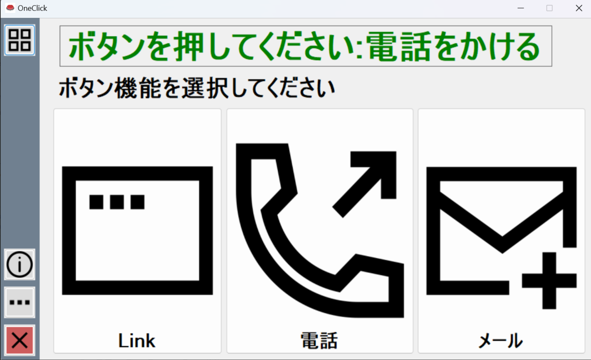

# Smart Button with ESP32

## Overview
This project is a **Smart Button** based on the ESP32 microcontroller. The purpose of the project is to make PC operation easy and understandable for older people. With the help of the button, users can trigger predefined actions on their computer, such as opening applications, changing settings, or sending messages.The device is designed to function as a wireless communication interface for triggering predefined actions. The button integrates **ESP-NOW**, **Wi-Fi**, **battery monitoring**, and an **OLED display** for visual feedback. The project includes both **firmware** (ESP32-side) and a **software application** (computer-side) based on C# to control the computer running Windows OS.

## Features
- **ESP-NOW Wireless Communication:** Enables low-latency, direct device-to-device communication.
- **OLED Display (SSD1351, SPI):** Provides visual feedback for the button's status and received commands.
- **Battery Monitoring:** Uses ADC calibration to estimate battery percentage.
- **External Power Detection:** Automatically detects external power and adjusts behavior.
- **Sleep Mode for Power Saving:** The device enters deep sleep when inactive for a certain period.
- **Configurable Timeout Alerts:** Notifies when the button loses connection.
- **ESP-NOW & UART Communication:** Supports both wireless peer-to-peer messaging and wired serial communication.
- **Computer-Side Application:** Monitors the button's status, performs actions on the computer and has an user interface for setting up button actions.

## Hardware Components
- **ESP32 Development Board**
- **SSD1351 OLED Display (SPI)**
- **Push Button**
- **Battery & Charging Circuit**
- **I2C Communication (SDA: GPIO21, SCL: GPIO22)**
- **Status LED (GPIO14)**
- **External Power Detection (GPIO39)**

## Circuit Diagram
The detailed schematic of the **Smart Button** circuit can be found in the [doc folder](./doc/Board_Schematic.pdf).

## PCB Layout
The project includes a fully designed two-layer PCB for manufacturing. Components are placed exclusevily on top layer to lower the assebly cost and simplify the repairs. For similar reason, in terms of component enclosure type, the preference was given to SMD components. Layout files are available in the hardware folder.

    <b>Top View:</b> 
    

        
    

    <b>Bottom View:</b> 
    

        
    

    <b>Side View:</b> 
    

        
    

## Software Features
The computer-side application for the Smart Button enhances its usability by allowing users to configure and automate various actions triggered by the button press. The application runs as a Windows GUI-based tool, providing an intuitive interface for setting up and managing button actions. 

Since the application is designed to run on Windows, it is developed using C# and .NET Framework. The application communicates with the Smart Button via a serial connection (UART). The framework and communication were chosen to be simple and easy to use and to fit older systems with limited resources.

There are two ways to connect the Smart Button to the computer:
1. **Wired Connection:** The Smart Button is connected to the computer via a USB cable, and the application communicates with the button over a serial port.
2. **Wireless Connection:** The Smart Button communicates with the computer over a wireless connection using the ESP32's ESP-NOW protocol. ESP32 reciever is connected to the computer via USB cable. 

#### **Key Features**
1. **Serial Communication with the Smart Button**
   - Automatically detects the Smart Button via **USB serial ports**.
   - Monitors and logs communication between the button and the PC.
   - Detects button presses and relays corresponding actions.

2. **Configurable Button Actions**
   - Users can assign different actions to the button, such as:
     - **Opening a website (link)**
     - **Making a phone call**
     - **Sending an email**
     - **Launching an application**
   - Each button press executes the assigned function immediately.

3. **Quick Action Setup & Profiles**
   - **User-defined actions** can be assigned to different buttons in the UI.
   - **Multiple configuration profiles** allow quick switching between different use cases.
   - **Preloaded default configurations** available on first launch.

4. **Real-Time Device Status Monitoring**
   - Displays the **current connection status** of the button.
   - Tracks the **last received ping** from the button to ensure connectivity.
   - Shows **battery status** if supported by the Smart Button.

5. **Graphical User Interface (GUI)**
   - Provides a **Windows Forms-based UI** for easy configuration.
   - Displays **icons** for different action types (browser, call, email, application).
   - Supports **customization of button labels and images**.

6. **System Tray Integration**
   - Runs **minimized in the system tray** to remain active in the background.
   - Right-click system tray menu allows quick access to settings and exit options.

7. **Automatic Device Detection**
   - Scans **available COM ports** and attempts to find the button.
   - Provides **visual indicators** if the button is successfully detected.

8. **Error Handling & Debugging Tools**
   - Logs device connection attempts and failures.
   - Displays **error messages** for missing configurations.
   - Allows **manual device selection** if automatic detection fails.

9. **Windows Registry & Configuration Management**
   - Reads and writes **configuration settings** using the **Windows Registry**.
   - Saves **user preferences** such as the default action and last-used settings.

10. **Power & Sleep Monitoring**
   - Tracks **button inactivity** to optimize power usage.
   - Monitors the **last button press time** to prevent unintended actions.
   - Supports **automatic sleep mode handling** if the button is inactive.

    <b>Main App Window:</b> 
    

    <b>Action Pick:</b> 
    

    <b>User Guide:</b> 
    

## Firmware Overview
The firmware is written using ESP-IDF and structured as follows:

### Key Components:
1. **ESP-NOW Communication**
   - Registers peers for sending/receiving messages.
   - Handles status updates and custom triggers.

2. **Battery & Power Management**
   - Reads battery voltage via ADC.
   - Detects external power and adjusts behavior accordingly.

3. **Sleep Mode**
   - Enters deep sleep mode if inactive for 60 seconds.
   - Wakes up when the button is pressed.

4. **Display Management**
   - Uses LovyanGFX for rendering text/icons.
   - Displays battery percentage, status updates, and alerts.

5. **Button Task**
   - Detects button presses and sends wireless data via ESP-NOW.
   - Provides visual feedback on the OLED screen.

6. **UART Communication**
   - Sends debug messages and status updates via UART.
   - Receives commands from the computer-side application.

7. **Configuration & Settings**
   - Stores default actions and settings in NVS.
   - Allows changing actions via ESP-NOW messages.

8. **Error Handling & Debugging**
   - Logs errors, warnings, and status updates.
   - Provides detailed information for troubleshooting.

## Mechanical Design

The **Smart Button** enclosure is a **custom-designed mechanical housing** that protects internal components while ensuring ease of use. The enclosure consists of **three main parts**:

1. **Top Enclosure** – Contains a **large window** to accommodate the display, ensuring clear visibility.  
2. **Bottom Enclosure** – Designed to securely hold the **PCB and battery**, optimizing space for a compact form factor.  
3. **Button** – A **large, colorful, and easy-to-press button**, providing a tactile and responsive experience.

    

        <b>Smart Button:</b> 
        
    

    

        <b>Receiver:</b> 
        
    

#### **Design & Manufacturing**
- The enclosure was designed using **Fusion 360** for precise integration with the PCB and battery.
- The entire assembly is **optimized for 3D printing**, allowing for easy prototyping and customization.
- The button design ensures **smooth actuation** while preventing accidental presses.

#### **Assembly & Fastening**
- Assembly is **simple and efficient**, requiring only **three bolts** to securely hold the enclosure together.
- The button fits into the **top enclosure**, allowing for **firm yet smooth movement** when pressed.

   

      <b>Main Body Assembly:</b> 
      
   

   

      <b>Receiver Assembly:</b> 
      
   

#### **Customization & Modifications**
- The **3D printable design** allows for easy modifications, such as:
  - Adjusting dimensions for alternative PCB layouts.
  - Customizing button colors and shapes for different applications.
  - Adding ventilation or additional mounting options.

    

## Usage
The **Smart Button** software provides an intuitive way to configure and use the button for different actions. 
This section explains how to install, configure, and use the software.

#### **1. Installation**
- Download the latest release of the **Smart Button** software.
- Extract the files to a preferred directory.
- Run the **setup.exe** from MagicButtonSetup/Release folder.
- Follow the installation wizard to complete the setup.
- Start the application from the desktop shortcut.

#### **2. Initial Setup**
- On the first launch, the application will prompt you to set up **default actions**.
- Select the desired action for button presses:
  - **Call**: Enter a phone number and contact name.
  - **Email**: Enter an email address and subject.
  - **Application**: Choose an application to launch.
  - **Website**: Enter a URL for quick access.
- Save the settings, and the software will remember them for future use.

#### **3. Connecting the Smart Button**
- Plug the **Smart Button** or receiver device into a USB port.
- The application will attempt to **auto-detect the device**.
- If the device is not detected:
  - Open the **Settings** panel and manually select the COM port.
- Once connected, the UI will show the device **status and connection logs**.

#### **4. Configuring Button Actions**
- Navigate to the **Button Setup** panel.
- Assign actions to different button presses:
  - **Short Press** → Quick Action (e.g., Open a website)
  - **Long Press** → Secondary Action (e.g., Make a call)
  - **Double Press** → Custom Action (e.g., Launch an application)
- Click **Save** to apply the changes.

#### **5. Using the Smart Button**
- **Single press** executes the assigned action.
- **Holding the button** triggers an alternative action.
- **Double-clicking** performs a special function (e.g., emergency contact).
- The system tray icon will show notifications about the current action.

#### **6. Monitoring Status & Logs**
- The **Main Dashboard** displays:
  - **Device Connection Status**
  - **Last Button Press Timestamp**
  - **Current Battery Level** (if supported)
  - **Recent Logs & Debug Messages**
- If the button loses connection, the software will display a **warning**.

#### **7. System Tray & Background Mode**
- The application can be minimized to the **system tray** for background operation.
- Right-click the tray icon to:
  - **Open Settings**
  - **Reconnect the Button**
  - **Exit the Application**

#### **8. Resetting & Troubleshooting**
- If the button stops responding:
  - Check the **USB connection**.
  - Restart the application and ensure the device is detected.
  - Use the **Reset Device** option in the settings.
  - Check device **battery level** and **power source**.

#### **9. Power Management & Sleep Mode**
- If the button is inactive for a long period:
  - It will enter **power-saving mode**.
  - The application will notify the user if a connection is lost.
  - The button can be **reactivated** with a press.
- The software monitors **battery percentage** and alerts the user if charging is needed.

## Future Enhancements
- **BLE Integration** for mobile applications.
- **Multi-button Pairing** for grouped communication.
- **Cloud Connectivity** via MQTT for IoT applications.

## Known issues
- **Battery Monitoring:** The battery percentage calculation may not be accurate due to voltage fluctuations.
- **PCB Design:** The butto component placement and connection has to be reconsidered, currently connection has to be manually fixed. The PCB layout may require further optimization for mass production.
- **ESP-NOW Communication:** The wireless communication may be affected by interference or distance limitations.

## License
This project is open-source under the **MIT License**.

## Acknowledgements
Special thanks to **Espressif** for the **ESP32** platform and **LovyanGFX** for display handling. The PCB design was based on [ESP32-DevKit-Lipo](https://github.com/OLIMEX/ESP32-DevKit-LiPo/tree/master) by Olimex, original files were changed to adapt to the project requirements.

